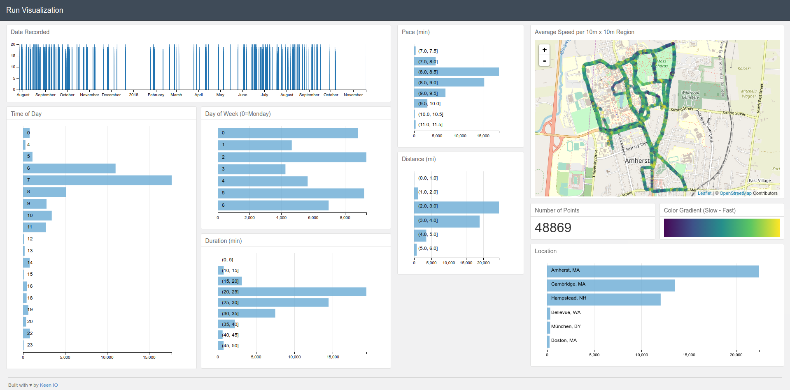

Inspiration for this visualization: [Interactive Data Visualization of Geospatial Data using D3.js, DC.js, Leaflet.js and Python](http://adilmoujahid.com//posts/2016/08/interactive-data-visualization-geospatial-d3-dc-leaflet-python/)

I modified it to show my run habits. Here is my blog post that inspired me to make this: [Becoming a Better Runner using Data](http://seangtkelley.me/blog/2019/01/19/better-runner)



# Dependencies

You need ```Python``` 2.7.x and 3 ```Python``` libraries: ```Pandas```, ```Flask```, ```Shapely```.

The easiest way to install ```Pandas``` is to install it as part of the [Anaconda distribution](https://www.continuum.io/downloads).

You can install ```Flask``` and ```Shapely``` using ```pip```.

```
pip install flask shapely
```

# How to run the code

1. Install all Python dependencies
2. Download your data from [RunKeeper](https://runkeeper.com/exportData)
3. Save the dataset where you want and modify the path in `app.py`
4. From the root folder, run ```python app.py```
